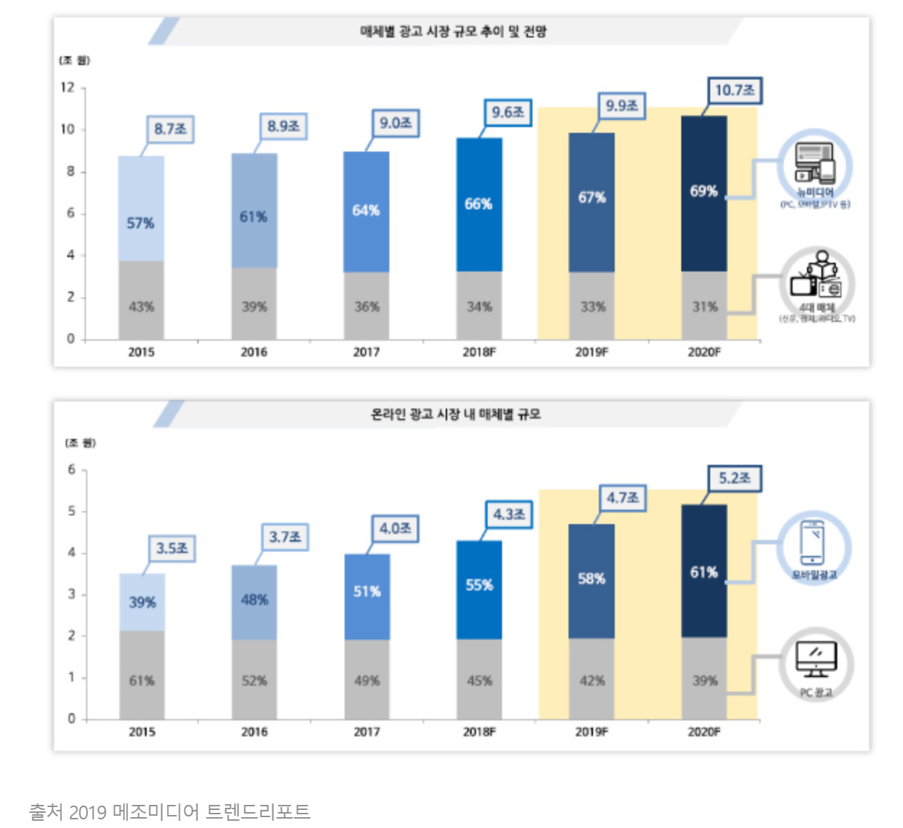

# 수익 창출 
### -인앱 광고를 통한 수익 창출
## 1. 모바일 광고 시장의 성장

- 전통적인 4대 매체의 비중은 감소하지만, 뉴미디어의 광고 비중은 지속 성장중이다.
- 모바일 광고 시장 역시 계속 성장중이며, 2020년에는 온라인 광고 시장의 61%를 차지할 전망이다.
- 모바일 광고 수익은 지난 수년 간 앱 경제의 버팀목 역할을 해왔으며, 앞으로도 안정적인 수입원이 될 것으로 보인다.  

## 2. 광고 비용 책정
앱의 특성에 알맞은 광고 과금 방식을 선택해야 한다.  
단가가 낮고 노출 범위가 넓은 CPM이나 CPC방식의 광고를 집행한다.

**(1)CPM**
- 광고 1000회 노출당 비용
- 적은 비용으로 많은 노출을 목적으로 한다.

**(2)CPC**
- 사용자가 광고를 클릭하거나 조회할 경우 클릭당 비용
- 클릭과 유입을 유도하기에 한계가 있는 CPM의 단점을 보완한다.  

## 3. 광고 유형 - 네이티브 광고

- 광고가 언론사 기사 형태로 제공됨
- 콘텐츠(뉴스기사)와 자연스럽게 어우러져 사용자 경험을 방해하지 않음
- 서비스 콘텐츠와 광고의 유사성을 통한 추가 노출 확보과 클릭 수 증가로 CMP, CPC를 강화

