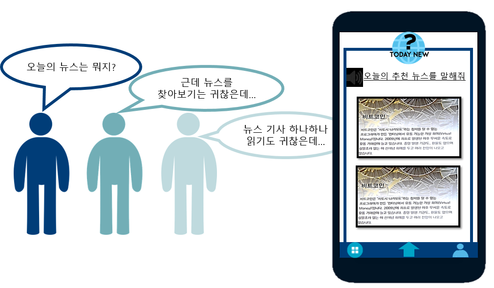
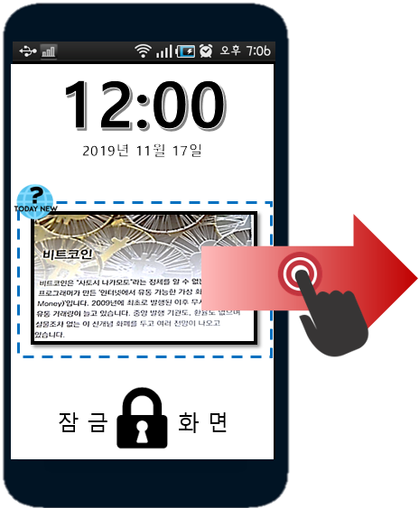
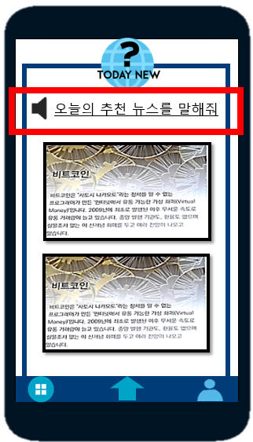
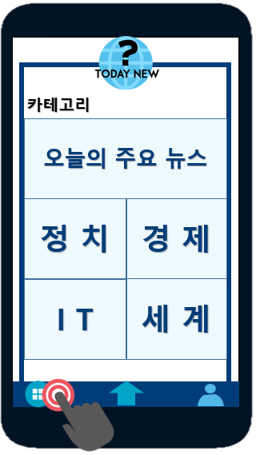
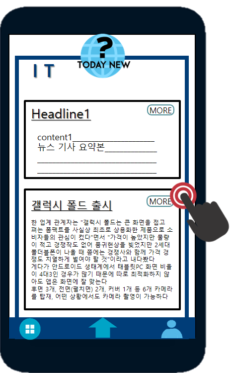
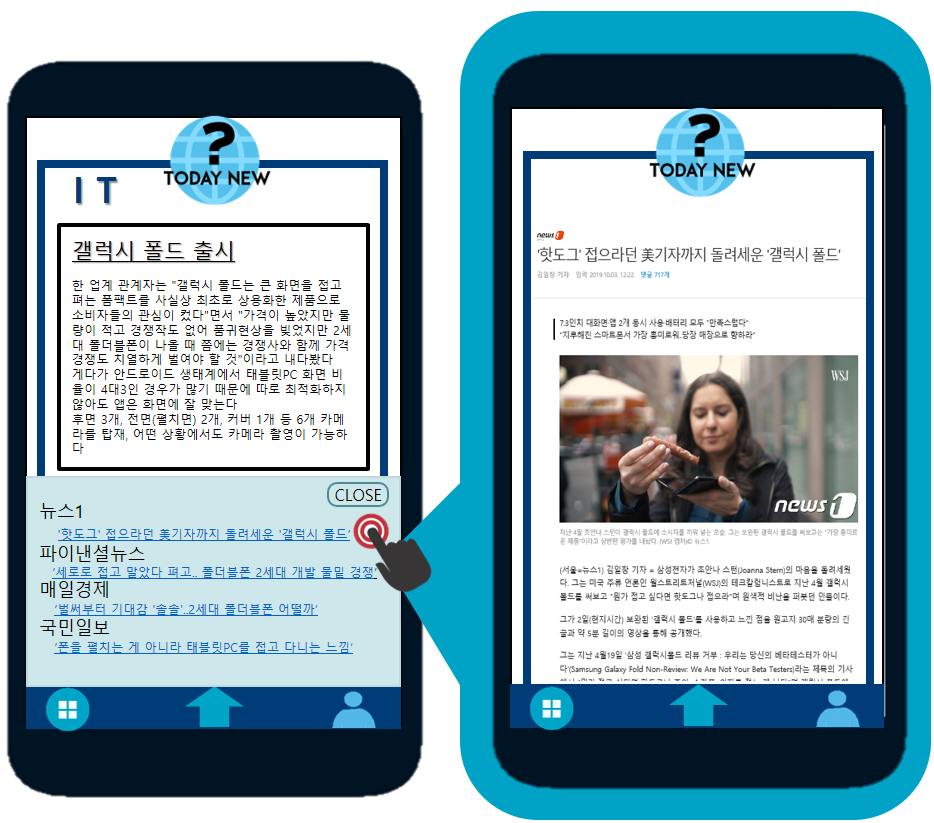

# `Today New` 사업계획서 2
#### AI summary news application
 
 
 
 
 
 
 
 

|MUD(Meeting Using DeepLearning) |
|-------------------------------:|
|201601364 박주영(T)	201503665 홍승환    &nbsp;&nbsp;&nbsp; &nbsp;&nbsp;&nbsp;&nbsp; &nbsp;&nbsp;&nbsp;&nbsp; &nbsp;&nbsp;&nbsp;&nbsp; &nbsp;&nbsp;&nbsp;&nbsp; &nbsp; &nbsp;&nbsp;&nbsp; &nbsp;&nbsp;&nbsp;&nbsp; &nbsp;&nbsp;&nbsp;&nbsp; &nbsp;&nbsp;&nbsp;&nbsp; &nbsp;&nbsp;&nbsp;&nbsp; &nbsp;&nbsp;&nbsp;&nbsp;&nbsp;&nbsp;&nbsp;&nbsp; &nbsp;&nbsp;&nbsp;&nbsp; &nbsp;&nbsp;&nbsp;&nbsp;&nbsp;&nbsp;&nbsp;&nbsp;201600599 김아연	  201701138 김혜원   201700000이산가 비두사       |

-------------------------------------------------------------
# 목차

> 1. 제품 개요
> 2. 제품 기획 및 배경
> 3. 제품 소개  
>     - 사용자 측면  
>     - 기술 측면
> 4. 시장 동향
>     - 시장 규모
>     - 진출 전략  
>          --  경쟁사 분석 + SWOT분석  
>          --  사업 구조 + 수익 모델  
>          --  마켓팅 전략
> 5. 분담 및 개발 계획

-------------------------------------------------------------
# 1. 제품개요
### `Today News?` APP = 뉴스 요약 APP
뉴스를 보고 싶어 하나, 뉴스를 찾아보거나, 뉴스 기사 하나하나를 읽어보기 귀찮아하는 사람들을 위해 기존 뉴스들보다 접근성 있고, 시각적으로 한눈에 오늘의 뉴스를 알려주는 APP
 즉, **뉴스를 봐야겠다고 생각은 하나, 뉴스를 보지 않는 타겟**에게 오늘 하루의 뉴스를 브리핑해주는 어플입니다. 

-------------------------------------------------------------
# 2. 제품 기획 및 배경

-------------------------------------------------------------
# 3. 제품 소개
### -사용자 측면
`Today News?` 어플리케이션을 통해   
그날의 **주요 뉴스 주제를 Headline**으로, 주제에 따른 뉴스기사 내용들의 **요약본을 content**로 나타냄.
나타내는 형태는 시각적으로 잠금화면이나 APP화면에서, 청각적으로 라디오 뉴스처럼 브리핑형식을 띔. 
 

 

&nbsp;&nbsp;&nbsp;&nbsp;&nbsp;&nbsp;&nbsp;&nbsp; **① 휴대폰 잠금 화면**에서 주요 오늘의 **뉴스의 주제와 내용요약**을 볼 수 있다.        &nbsp;&nbsp;&nbsp;&nbsp;&nbsp;&nbsp;&nbsp;&nbsp;&nbsp;&nbsp;&nbsp;&nbsp;(기사를 읽어야 하는 것이 아니다) 기사를 옆으로 드래그하면 다른 뉴스도 볼 수 있다.  
&nbsp;&nbsp;&nbsp;&nbsp;&nbsp;&nbsp;&nbsp;&nbsp; **②** 다른 육체적 행동을 하고 있을 때, 시간의 효율성을 위해 **라디오처럼 그날의 추천 뉴스를 브리핑** 받을 수 있다  
&nbsp;&nbsp;&nbsp;&nbsp;&nbsp;&nbsp;&nbsp;&nbsp; **③** APP을 실행시키면 첫 화면에 **오늘의 추천 뉴스 TOP20**을 보여준다.  
&nbsp;&nbsp;&nbsp;&nbsp;&nbsp;&nbsp;&nbsp;&nbsp; **④** 카테고리를 클릭하면 **오늘의 주요 뉴스 TOP20**, 정치,경제,IT,세계 카테고리가 있다.  

 

&nbsp;&nbsp;&nbsp;&nbsp;&nbsp;&nbsp;&nbsp;&nbsp; **⑤** 카테고리를 선택 시, **Headline과 content(기사들 내용 요약)형식**으로 뉴스내용을 알 수 있다.  
&nbsp;&nbsp;&nbsp;&nbsp;&nbsp;&nbsp;&nbsp;&nbsp; **⑥** 각 Headline의 MORE버튼을 누르면 위젯형식으로 **언론사 별 관련 뉴스제목**이 볼 수 있고, 
&nbsp;&nbsp;&nbsp;&nbsp;&nbsp;&nbsp;&nbsp;&nbsp;&nbsp;&nbsp;  뉴스제목은 해당 뉴스 웹페이지와 하이퍼링크 되어 있어 클릭 시 **실제 기사**를 볼 수 있다. 

### -기술 측면

 

제품 기능 |     내용    | 적용 기술
:------------: | :------------: | --------------
이슈토픽 뽑기 | 각 카테고리 별 오늘의 뉴스들을 비슷한 토픽으로 묶는다 (군집화) 이후 랭킹알고리즘을 이용해 주요 토픽순으로 나열한다.  | K-mean 클러스터링
Headline,  Content 추출 | 실제 뉴스 기사를 직접 읽게 하지 않고, 군집화된 토픽(유사 기사내용 뉴스들 묶음)에서 HeadLine 제목을 추출, 군집 낸 기사내용전체를 요약하여 간단하게 Content로 보여줌  | 추상적 요약 +추출적 요약
개인추천 시스템 | APP첫화면에 그날의 뉴스를 관심가질 것 같은 순, 추천순으로 보여준다.  MORE버튼을 클릭할때 마다 더 알아보고자 하는 관심뉴스로 판단하여 클릭을 기준으로 추천 알고리즘을 적용 시킴   |추천 알고리즘

 

- K-mean 클러스터링

  - 군집화(Clustering) : 레이블이 없는 데이터를 비슷한 군집으로 묶는 것.

  - 어떤 데이터 셋(set)이 있고 N개의 클러스터로 분류하겠다고 가정하면, 그 데이터 셋에는 N개의 중심(centroid)이 존재한다. 각 데이터들은 유클리디안 거리를 기반으로 가까운 중심에 할당되고, 같은 중심에 모인 데이터 그룹이 하나의 클러스터가 된다.
  
  
  ~~~
  크롤링한 카테고리 별 오늘의 뉴스 기사들의 내용을 K-mean 클러스터링의 DATA Set으로 하여 비슷한 토픽으로 군집화
  도출된 N개의 클러스터(군집)들이 Topic이 되고 다음의 요약 알고리즈을 통해 Headline과 Content를 추출
    
- 요약 알고리즘

  - 추출적 요약 (랭킹 알고리즘)
       : 비지도 학습으로 통계적 수치를 기반으로 한 알고리즘 (LexRank 사용 예정)
  
  - 추상적 요약 
       : 지도 학습을 통해서 사람이 직접 요약하듯 가독성이 좋은 텍스트를 제공하는 알고리즘
  
  
  ~~~
  상용화된 추출적 요약과, 현재 개발 중인 추상적 요약을 결합하는 2단계 요약을 사용할 예정
  참고 : [한국정보과학회 2019 한국컴퓨터종합학술대회 논문집]추출 요약과 생성 요약을 결합한 2단계 문서 요약 
  
- 추천 알고리즘

  - 콘텐츠 기반 접근      :사용자와 아이템 정보에만 의존하여 선호도를 예측
    
    - 아이템 속성분석 - 비구조적 데이터 (키워드 분석) : TF-IDf, 코사인 유사도 이용 
    
    - 사용자 선호도 학습 - 기계학습(KNN 기법) 이용하여 선호도 정확 파악
         K-NN 최근접 이웃법은 한마디로 지도학습을 통해 유유상종찾기입니다. 
 새로운 데이터를 입력 받았을 때 가장 가까이 있는 것이 무엇이냐를 중심으로 새로운 데이터의 종류를 정해주는 분류 알고리즘 입니다. 

    
     
    
    |||
    | :------: | -------- |
    |**+**|독립정 정보 활용, 새로운 아이템 :  새로운 고객이 등록되더라도 독립적 정보만 필요함으로 속성 파악하여 카테고리 할당가능|
    |**-**|과도한 특수화 :  과거 이력만 바탕으로 함으로 추천 뉴스의 다양성이 보장되지 않음|
  
  - 협력 필터링       :사용자가 아이템에 대해 평가한 정보를 사용해 선호도를 예측
  
    - 기억 기반 - (유사도 측정/ 선호도 예측)
         :사용자 기반 협력필터링은 사용자가 입력한 선호도 정보를 이용하여 고객과 유사한 성향을 갖는 이웃 사용자를 선별한 뒤, 선별된 이웃들이 공통적으로 선호하는 아이템을 고객에게 추천해주는 방식
    
    - 모델 기반 - 기억 기반 협력필터링(유사도 측정, 선호도 예측 등의 과정)+(기계학습, 데이터마이닝 기법)
    
    |||
    | :------: | -------- |
    |**+**|확장성, 추천의 다양상 :  자신과 유사 취향의 고객을 연결하여 즉각적으로 다양하게 추천함|
    |**-**|데이터 희소성 :  정보가 없는 새로운 고객이 들어오면 유사성을 찾을 수 없어 추천 불가|
  
  ~~~ 
  Today News의 추천알고리즘은 추천 시스템의 접근 방식 별로 테스트 한 후,
  두 접근 방식의 장단점을 고려하여 결합시킨 형태 ( 요즘 협력 필터링 추세) 로 적용 시킬

-------------------------------------------------------------
# 4. 시장 동향

-------------------------------------------------------------
# 5. 분담 및 개발 계획

