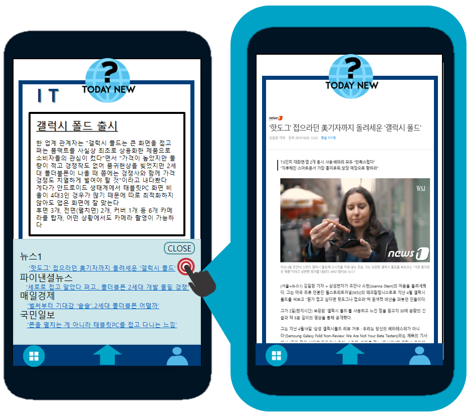

<!--<<<<<<< HEAD-->
# `Today News` 사업계획서 2
#### AI summary news application
 
 
 
 
 
 
 
 

|MUD(Meeting Using DeepLearning) |
|-------------------------------:|
|201601364 박주영(T)	201503665 홍승환    &nbsp;&nbsp;&nbsp; &nbsp;&nbsp;&nbsp;&nbsp; &nbsp;&nbsp;&nbsp;&nbsp; &nbsp;&nbsp;&nbsp;&nbsp; &nbsp;&nbsp;&nbsp;&nbsp; &nbsp; &nbsp;&nbsp;&nbsp; &nbsp;&nbsp;&nbsp;&nbsp; &nbsp;&nbsp;&nbsp;&nbsp; &nbsp;&nbsp;&nbsp;&nbsp; &nbsp;&nbsp;&nbsp;&nbsp; &nbsp;&nbsp;&nbsp;&nbsp;&nbsp;&nbsp;&nbsp;&nbsp; &nbsp;&nbsp;&nbsp;&nbsp; &nbsp;&nbsp;&nbsp;&nbsp;&nbsp;&nbsp;&nbsp;&nbsp;201600599 김아연	  201701138 김혜원   201700000이산가 비두사       |

-------------------------------------------------------------
# 목차

> 1. 제품 개요
> 2. 제품 기획 및 배경
>     - 제품 개요
>     - 제품 기획 배경
> 3. 제품 소개  
>     - 사용자 측면  
>     - 기술 측면
> 4. 시장 분석
>     - 시장 동향
>     - 진출 전략  
>          --  경쟁사 분석  
>          --  수익 모델 + 수익 창출  
>          --  마켓팅 전략
> 5. 분담 및 개발 계획

-------------------------------------------------------------
# 1. 제품개요
### `Today News?` APP = 뉴스 요약 알림 APP
뉴스를 보고 싶어 하나, 뉴스를 찾아보거나, 뉴스 기사 하나하나를 읽어보기 귀찮아하는 사람들을 위해 기존 뉴스들보다 접근성 있고, 시각적으로 한눈에 오늘의 뉴스를 알려주는 APP
 즉, **뉴스를 봐야겠다고 생각은 하나, 뉴스를 보지 않는 타겟**에게 오늘 하루의 뉴스를 브리핑해주는 어플입니다. 

-------------------------------------------------------------
# 2. 제품 기획 및 배경

 
최근 요약 컨텐츠 사업이 떠오르고 있습니다. 그 이유는 아래 설문조사 내용에서 볼 수 있듯 Time-Poor족 즉, 시간이 부족하다고 생각하는 사람들이 많이 늘어나고 있기 때문입니다. 그래서 짧은 시간으로 다양한 정보를 습득할 수 있는 요약 시장이 활발해 지고 있습니다. 

이러한 시장을 파악 후 요약 컨텐츠 사업 아이템을 찾는 중에 저희는 뉴스 요약을 선택했습니다. 그 이유는 밑에 두 자료를 보고 기술 하겠습니다.

연도|텔레비전|	모바일	|PC|	종이신문|	라디오|	소셜미디어
--|--|--|--|--|--|--
2015년|	47.8|	25.4|	12.2|8.9	|3.1|	2.6
2016년|	42.5|	29.8|	13.1|	7.5	|3.6|	3.5
2017년|	40.4|	29.4|	13.5|	6.4|	3.7|	6.6
2018년|	38.9|	33.3|	11.6|	7.9|	4.4|	4.0

###### 미디어별 여론 집중 통계 한국언론진흥원

###### 연령별 뉴스 소비 현황  2017 네이버 뉴스 통계

위의 두 자료를 보고 저희는 한가지 문제점을 파악할 수 있었습니다. 점차 증가하는 모바일을 통한 뉴스 소비에 비해 20대의 뉴스 소비가 현저히 낮다는 것입니다.
저희는 이 문제에 대한 이유로 너무 방대한 정보량을 들었습니다. 

###### 1일 평균 기사량  2017 네이버 뉴스 통계

이미지에서 확인할 수 있듯이 하루에 쏟아지는 기사량은 상당합니다. 이러한 기사들을 전부 읽을 순 없고 저희는 간략화 하여 접근성을 낮출 필요가 있다고 생각했습니다. 그래서 해결 방안으로 생각한것이 바로 요약입니다. 그래서 저희는 이 제품을 기획했습니다.

-------------------------------------------------------------
# 3. 제품 소개
### -사용자 측면
`Today News?` 어플리케이션을 통해   
그날의 **주요 뉴스 주제를 Headline**으로, 주제에 따른 뉴스기사 내용들의 **요약본을 content**로 나타냄.
나타내는 형태는 시각적으로 잠금화면이나 APP화면에서, 청각적으로 라디오 뉴스처럼 브리핑형식을 띔. 
 

 

&nbsp;&nbsp;&nbsp;&nbsp;&nbsp;&nbsp;&nbsp;&nbsp; **① 휴대폰 잠금 화면**에서 주요 오늘의 **뉴스의 주제와 내용요약**을 볼 수 있다.        &nbsp;&nbsp;&nbsp;&nbsp;&nbsp;&nbsp;&nbsp;&nbsp;&nbsp;&nbsp;&nbsp;&nbsp;(기사를 읽어야 하는 것이 아니다) 기사를 옆으로 드래그하면 다른 뉴스도 볼 수 있다.  
&nbsp;&nbsp;&nbsp;&nbsp;&nbsp;&nbsp;&nbsp;&nbsp; **②** 다른 육체적 행동을 하고 있을 때, 시간의 효율성을 위해 **라디오처럼 그날의 추천 뉴스를 브리핑** 받을 수 있다  
&nbsp;&nbsp;&nbsp;&nbsp;&nbsp;&nbsp;&nbsp;&nbsp; **③** APP을 실행시키면 첫 화면에 **오늘의 추천 뉴스 TOP20**을 보여준다.  
&nbsp;&nbsp;&nbsp;&nbsp;&nbsp;&nbsp;&nbsp;&nbsp; **④** 카테고리를 클릭하면 **오늘의 주요 뉴스 TOP20**, 정치,경제,IT,세계 카테고리가 있다.  

 

&nbsp;&nbsp;&nbsp;&nbsp;&nbsp;&nbsp;&nbsp;&nbsp; **⑤** 카테고리를 선택 시, **Headline과 content(기사들 내용 요약)형식**으로 뉴스내용을 알 수 있다.  
&nbsp;&nbsp;&nbsp;&nbsp;&nbsp;&nbsp;&nbsp;&nbsp; **⑥** 각 Headline의 MORE버튼을 누르면 위젯형식으로 **언론사 별 관련 뉴스제목**이 볼 수 있고, 
&nbsp;&nbsp;&nbsp;&nbsp;&nbsp;&nbsp;&nbsp;&nbsp;&nbsp;&nbsp;  뉴스제목은 해당 뉴스 웹페이지와 하이퍼링크 되어 있어 클릭 시 **실제 기사**를 볼 수 있다. 

### -기술 측면

 

제품 기능 |     내용    | 적용 기술
:------------: | :------------: | --------------
이슈토픽 뽑기 | 각 카테고리 별 오늘의 뉴스들을 비슷한 토픽으로 묶는다 (군집화) 이후 랭킹알고리즘을 이용해 주요 토픽순으로 나열한다.  | K-mean 클러스터링
Headline,  Content 추출 | 실제 뉴스 기사를 직접 읽게 하지 않고, 군집화된 토픽(유사 기사내용 뉴스들 묶음)에서 HeadLine 제목을 추출, 군집 낸 기사내용전체를 요약하여 간단하게 Content로 보여줌  | 추상적 요약 +추출적 요약
개인추천 시스템 | APP첫화면에 그날의 뉴스를 관심가질 것 같은 순, 추천순으로 보여준다.  MORE버튼을 클릭할때 마다 더 알아보고자 하는 관심뉴스로 판단하여 클릭을 기준으로 추천 알고리즘을 적용 시킴   |추천 알고리즘

 

- K-mean 클러스터링

  - 군집화(Clustering) : 레이블이 없는 데이터를 비슷한 군집으로 묶는 것.

  - 어떤 데이터 셋(set)이 있고 N개의 클러스터로 분류하겠다고 가정하면, 그 데이터 셋에는 N개의 중심(centroid)이 존재한다. 각 데이터들은 유클리디안 거리를 기반으로 가까운 중심에 할당되고, 같은 중심에 모인 데이터 그룹이 하나의 클러스터가 된다.
  
    
- 요약 알고리즘

  - 추출적 요약 (랭킹 알고리즘)
       : 비지도 학습으로 통계적 수치를 기반으로 한 알고리즘 (LexRank 사용 예정)
  
  - 추상적 요약 

- 추천 알고리즘

  - 콘텐츠 기반 접근      :사용자와 아이템 정보에만 의존하여 선호도를 예측
     **+**  독립정 정보 활용, 새로운 아이템 : 새로운 고객이 등록되더라도 독립적 정보만 필요함으로 속성 파악하여 카테고리 할당가능
        **-**  과도한 특수화 : 과거 이력만 바탕으로 함으로 추천 뉴스의 다양성이 보장되지 않음
  
  - 협력 필터링       :사용자가 아이템에 대해 평가한 정보를 사용해 선호도를 예측
     **+**  확장성, 추천의 다양상 : 자신과 유사 취향의 고객을 연결하여 즉각적으로 다양하게 추천함  
        **-**  데이터 희소성 : 정보가 없는 새로운 고객이 들어오면 유사성을 찾을 수 없어 추천 불가
  
  ~~~ `Today News`의 추천알고리즘은 추천 시스템의 접근 방식 별 장단점을 활용하여 
  하이브리드 시스템을 적용시킬 예정

-------------------------------------------------------------
# 4. 시장 분석
### - 시장 동향
##### <1>뉴스 미디어 모바일 장악

|
------|------
출처: [뉴스 미디어 장악1]|[뉴스 미디어 장악2]

:point_right: 시민의 뉴스 이용 흐름이 고정형 플랫폼에서 모바일 플랫픔으로 옮겨가고 있다는 조사 결과가 나왔다.
한국 언론 진흥 재단의 '언론수용자 의식 조사'에 따르면 모바일 인터넷을 통한 뉴스 이용률은 2011년 19.5%에서  2018년 80.8%로 4배 이상 증가했다.

##### <2>뉴스 이용률 연령별 현황

출처: [모바일 뉴스 연령별] 

:point_right: 뉴스 이용이 연령대에 따라 분명한 차이를 보여주고 있습니다. 연령별로 총 뉴스 소비시간을 보시면 10~60대이상 사이에서 20대는 뒤에서 2번째로 다른 연령대에 비해 뉴스 이용률이 떨어지는것을 보여줍니다.

##### <3>20대의 모바일 뉴스 비중

출처: [20대 모바일 뉴스]

:point_right: PC보다 모바일을 통한 뉴스 이용 비중이 높습니다. PC,모바일을 통한 뉴스 이용시간은 모두 20대는 2위를 차지하고 있습니다. 뉴스 이용률 연령별에서 20대의 뉴스 이용률은 떨어지지만 현재 모바일을 이용한 뉴스 이용률은 다른 세대에 비해 높은 것을 알 수 있습니다.

### - 진출 전략
#### <1> 경쟁사 파악
경쟁사 | | | 
------|------|------|------
경쟁사 | **뉴닉** | **텐 뉴스** | **썰리**
뉴스 제공 방식 | 뉴스 레터| APP(요약본+기사URL) | WEB 또는 APP(대화형 기사)
구독자 수 | 약 65,000명|약 10,000명|약 50,000명
투자 현황 |현재 뉴닉에 따르면 최근 500스타트업(500 Startups), 메디아티 등이 총 6억원을 투자 하였다(2019년 9월 8일 기준) 출처 :["밀레니얼 잡아라"]|텐뉴스는 중앙일보에서 만들어낸 서비스로 기업으 지원 아래 서비스를 제공한다|썰리는 중앙일보에서 만들어낸 서비스로 기업의 지원 아래 서비스 제공한다  출처 :["썰리 브랜드로 새 비즈니스 시동 건다"]
타켓층 | 뉴스를 보지 않는 20대|바쁜 일상에서 뉴스 핵심만을 원하는 타임푸어족(20~40대)| 접근하기 힘들고 기성 독자에 포커싱된 뉴스에 대해 어려움을 느끼는 20~30대
경쟁사 특징| * 다른 뉴스들과 달리 '독자 중심의 접근방식'을 기준으로 뉴닉을 창시했다.  * 이때 뉴닉은 사용자들에게 월,수,금요일에 사용자에게 사용자 맞춤 뉴스를 메일로 전송해준다.| * 아침,점심,저녁 시간대 별 뉴스 업데이트와 AI가 뽑아주는 뉴스를 딱 10가지를 보여주고 또는 음성 브리핑 서비스 받을 수 있다.  * 10가 뉴스 화면은 요약본으로 보여주고 해당 뉴스를 클릭 시 본문을 보여준다| * 썰리는 자신이 관심있는 카테고리를 지정하면 카테고리에 맞는 기사가 나온다.  * 기사를 클릭하게 되면 가상의 두명 인물이 대화를 나누는듯 한 화면에 '특정 주제'에 대해 친절하게 설명해주는 방식이다

#### <2> 수익 모델과 수익 창출
**수익모델**

**인앱 광고를 통한 수익 창출**

  (1)모바일 광고 시장의 성장 
    

    - 전통적인 4대 매체의 비중은 감소하지만, 뉴미디어의 광고 비중은 지속 성장중이다.
    - 모바일 광고 시장 역시 계속 성장중이며, 2020년에는 온라인 광고 시장의 61%를 차지할 전망이다.
    - 모바일 광고 수익은 지난 수년 간 앱 경제의 버팀목 역할을 해왔으며, 앞으로도 안정적인 수입원이 될 것으로 보인다.  

  (2)광고 비용 책정 
      앱의 특성에 알맞은 광고 과금 방식을 선택해야 한다.  
      단가가 낮고 노출 범위가 넓은 CPM이나 CPC방식의 광고를 집행한다.

>  - CPM
   
    - 광고 1000회 노출당 비용
    - 적은 비용으로 많은 노출을 목적으로 한다.

>  - CPC
   
    - 사용자가 광고를 클릭하거나 조회할 경우 클릭당 비용
    - 클릭과 유입을 유도하기에 한계가 있는 CPM의 단점을 보완한다.  

  (3)광고 유형 - 네이티브 광고 
  
  
    - 광고가 언론사 기사 형태로 제공됨
    - 콘텐츠(뉴스기사)와 자연스럽게 어우러져 사용자 경험을 방해하지 않음
    - 서비스 콘텐츠와 광고의 유사성을 통한 추가 노출 확보과 클릭 수 증가로 CMP, CPC를 강화

**종량제 모델을 통한 뉴스 유료화**
  (1)종량제 모델과 도입 이유 
  
    종량제 모델이란? 
    - 종량제는 무료 기사 건수에 제한을 두고 그 이상의 기사를 읽으려면 유료 결제를 하는 방식

    뉴스 유료화의 한계
    - 포털 사이트에서 무료로 콘텐츠를 보는 문화가 정착
    - 다수의 구독자가 뉴스 콘텐츠를 유료로 전환할 경우 보지 않을 것이라 답함

    도입 이유
    - 광고 매출의 한계성
    - 구독료를 통해 콘텐츠의 가치를 제대로 평가받기 위함

  (2)적용
  
    - 어느정도 구독자를 확보하고 시스템이 안정화가 된 후 종량제 모델을 도입한다.
    - 하루 3건의 기사는 무료, 그 이후의 기사는 일정의 돈을 지불해야 볼 수 있다.
    - 일정 금액으로 코인을 구매하며 뉴스 한 건당 2코인으로 열람할 수 있다.
 
단위|1000원|5000원|10000원|50000원
-----:|-----:|------:|------:|------:
 coin|2|3|4|5
 
 (뉴스 1건: 2 Mcoin)

#### <3> 마케팅 전략
**시장 세분화**

*타겟층: 20대*

     - 평균적으로 다른 세대에 비해 뉴스를 즐겨보지는 않는다.
     - 모바일 이용이 가장 많은 세대이다.
     - 뉴스를 주로 모바일상에서 포털, 앱을 통해 접한다.  
     - 사회변화에 민감하고 시사상식의 중요성을 깨닫고 있다.
     - 뉴스를 잘 보지 않는 이유는 대부분 시간에 쫓기거나 뉴스를 어려워하기 때문이다.

**타겟팅**

    - 세상이 돌아가는 소식을 알고 싶지만, 뉴스를 볼 새가 없이 바쁜 사람들(시간절약)
    - 개인 맞춤형 추천 뉴스가 필요한 사람들(개인화)
    - 뉴스의 요약본을 제공받고 싶은 사람들(요약)
    - 세상이 어떻게 돌아가는지 알고싶은 사람들(상식)

**포지셔닝**

    - 시사상식 VS **최근 주요 뉴스**: 최근 주요 뉴스에 포커스를 둔다.
    - 전 사용자 추천 VS **개인형 추천**: 전 사용자 추천 뉴스가 아니 개인형 맞춤 뉴스이다.
    - 대화형 뉴스 VS **기사형 뉴스** : 기사형 뉴스를 제공한다.

-------------------------------------------------------------
# 5. 분담 및 개발 계획
### 역할 분담
성명|역할|역할에 따른 준비
--|--|--
박주영|추출,추상적 요약, 서버 구축| attention mechanism과 seq2seq를 통한 모델 설계 및 서버 구축
김아연|추출,추상적 요약, 서버 구축|attention mechanism과 seq2seq를 통한 모델 설계 및 서버 구축
김혜원|비정형 클러스터링, 앱 개발| k-means 클러스터링에 대한 이해와 구현 및 앱 개발을 위한 플러터 학습 및 구현
이산가 비두사|앱 개발, 추천 알고리즘| 앱 개발을 위한 플러터 학습 및 구현과 추천 알고리즘을 위한 Collaborative Filtering 학습 및 최적의 알고리즘 선별
홍승환|비정형 클러스터링, 추천 알고리즘|k-means 클러스터링에 대한 이해와 구현 및 추천 알고리즘을 위한 Collaborative Filtering 학습 및 최적의 알고리즘 선별

### 개발 계획표

<!-- 출처 자료 사이트 모음집-->
[뉴스 미디어 장악1]:http://mediaus.co.kr/news/articleView.html?idxno=141439
[뉴스 미디어 장악2]:https://newsmapping.com/news-from-data
[모바일 뉴스 연령별]:http://www.koreanclick.com/insights/newsletter_view.html?code=topic&id=417&page=1
[20대 모바일 뉴스]:https://newsmapping.com/news-from-data
["밀레니얼 잡아라"]:http://biz.chosun.com/site/data/html_dir/2019/08/13/2019081302370.html
["썰리 브랜드로 새 비즈니스 시동 건다"]:http://www.editw.or.kr/news/articleView.html?idxno=391
